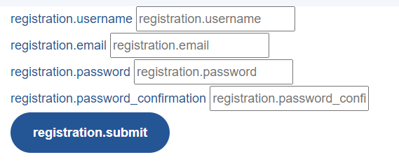

## Creating Forms
In this page we will create a basic registration form, from start to finish.

* [Defining the form fields](#defining-the-form-fields)
* [Defining the form controller](#defining-the-form-controller)
* [Showing the form](#showing-the-form)
* [Making prettier forms](#making-prettier-forms)
* [Multi file uploads](#multi-file-uploads)

## <a name="defining-the-form-fields"></a>Defining the form fields

To start with, we will need to define the fields for our form. To do this, create a new file called `RegistrationForm.php` in the `App\Forms` folder.

```php
<?php

namespace App\Forms;

use Codedor\LivewireForms\Form;

class RegistrationForm extends Form
{

}
```

Easy enough, now we need to add the `fields()` function, where we will define our fields.

```php
public function fields(): array
{
    return [

    ];
}
```

Let's start by adding fields for the username, email and password, along with a submit button.
Read more about the different field types and how to work with them [here](fields.md).

```php
use Codedor\LivewireForms\Fields\;

public function fields(): array
{
    return [
        TextField::make('username')
            ->label(__('registration.username'))
            ->rules('required'),

        EmailField::make('email')
            ->label(__('registration.email'))
            ->rules('required'),

        PasswordField::make('password')
            ->label(__('registration.password'))
            ->rules('required'),

        Button::make(__('registration.submit'))
    ];
}
```

Already we can see there is some duplication of code, namely the `->rules('required')`.
We can change this by putting our fields inside of a group, like this:

```php
public function fields(): array
{
    return [
        Group::make()
            ->rules('required')
            ->fields([
                TextField::make('username')
                    ->label(__('registration.username')),

                EmailField::make('email')
                    ->label(__('registration.email')),

                PasswordField::make('password')
                    ->label(__('registration.password')),
            ]),

        Button::make(__('registration.submit'))
    ];
}
```

## <a name="defining-the-form-controller"></a>Defining the form controller
To show the form on the frontend, we need to create the form livewire controller.
Make a new file called `App\Http\Livewire\RegistrationForm.php`

```php
<?php

namespace App\Http\Livewire;

use Codedor\LivewireForms\FormController;

class RegistrationForm extends FormController
{

}
```

We need to tell livewire what form to load, do this by adding the `$form` attribute.

```php
public $formClass = \App\Forms\RegistrationForm::class;
```

We also need to tell livewire what model we are saving.
This is optional, however in this case we need to define the `User` model
```php
public $modelClass = \App\Models\User::class;
```

## <a name="showing-the-form"></a>Showing the form
Now all that's left is showing the form in the frontend.
Go to your desired blade file and add this code to it:

```php
@livewire('registration-form')
```

If all went well, you should see your form, and it's fully functional!



## <a name="making-prettier-forms"></a>Making prettier forms
Right now, all the fields are just under each other, we can do better!
We can define rows to the fields, you can do this by simply adding `Row` fields:

```php
public function fields(): array
{
    return [
        Group::make()
            ->rules('required')
            ->fields([
                Row::make([
                    TextField::make('username')
                        ->label(__('registration.username')),

                    EmailField::make('email')
                        ->label(__('registration.email')),
                ]),

                Row::make([
                    PasswordField::make('password')
                        ->label(__('registration.password')),
                ]),
            ]),

        Row::make([
            Button::make(__('registration.submit'))
        ])
    ];
}
```

Much better!
Remember: you can always add custom components etc to everything, [or make your own fields](custom-fields.md)!


## <a name="multi-file-uploads"></a>Multi file uploads
When using fields like the [MultiFileField](fields.md#multi-file-field), you'll need to add your relation names to the `$sync` attribute of your form, otherwise your pivot data will not save!

```php
public $syncs = ['attachments'];
```

The [syncData step in the FormController](form-controllers.md#sync-data) takes care of the syncing.

## <a name="something-more"></a>When you need something more
When your form needs to do something extra special, no worries, you can change how everything works.
For more information, look right [here](form-controllers.md).
